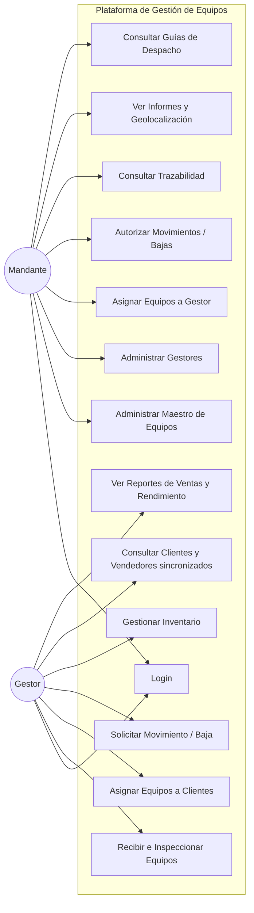
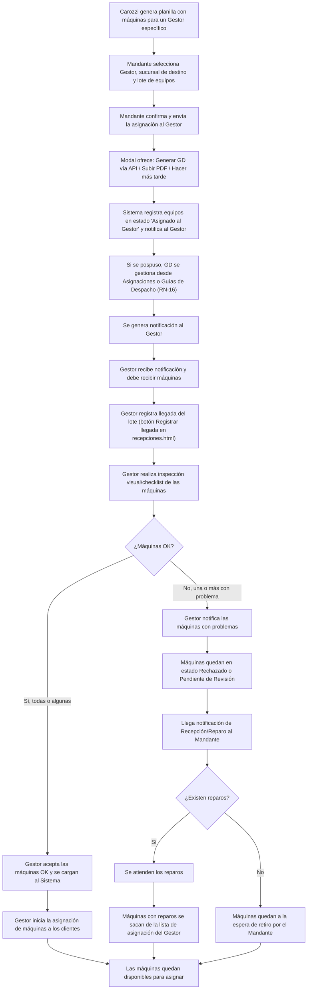
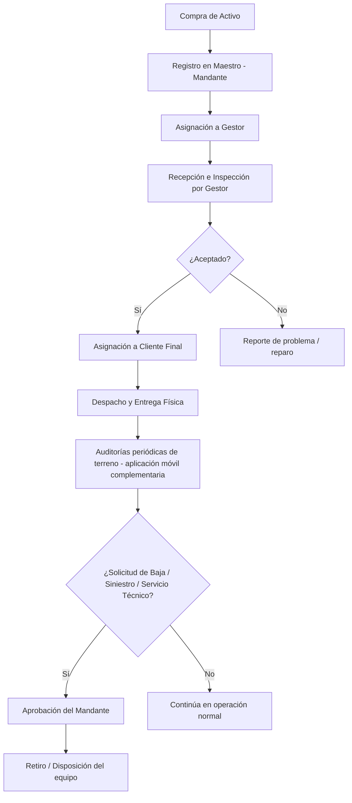
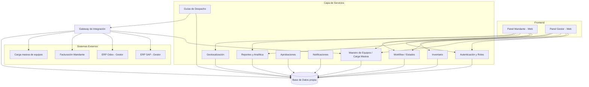
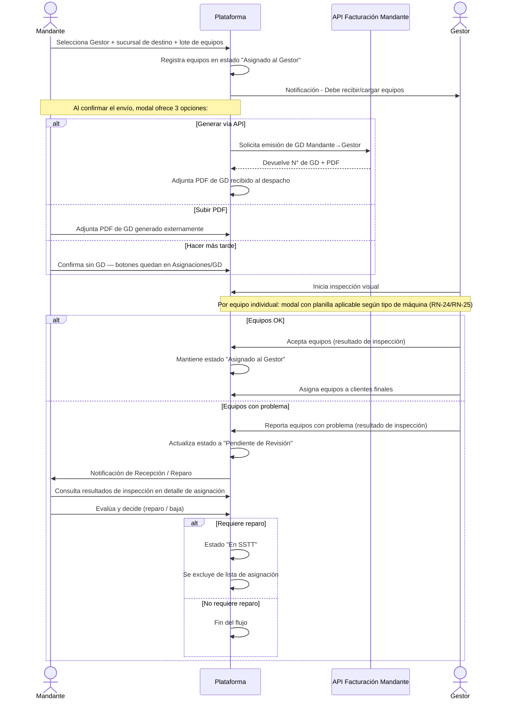
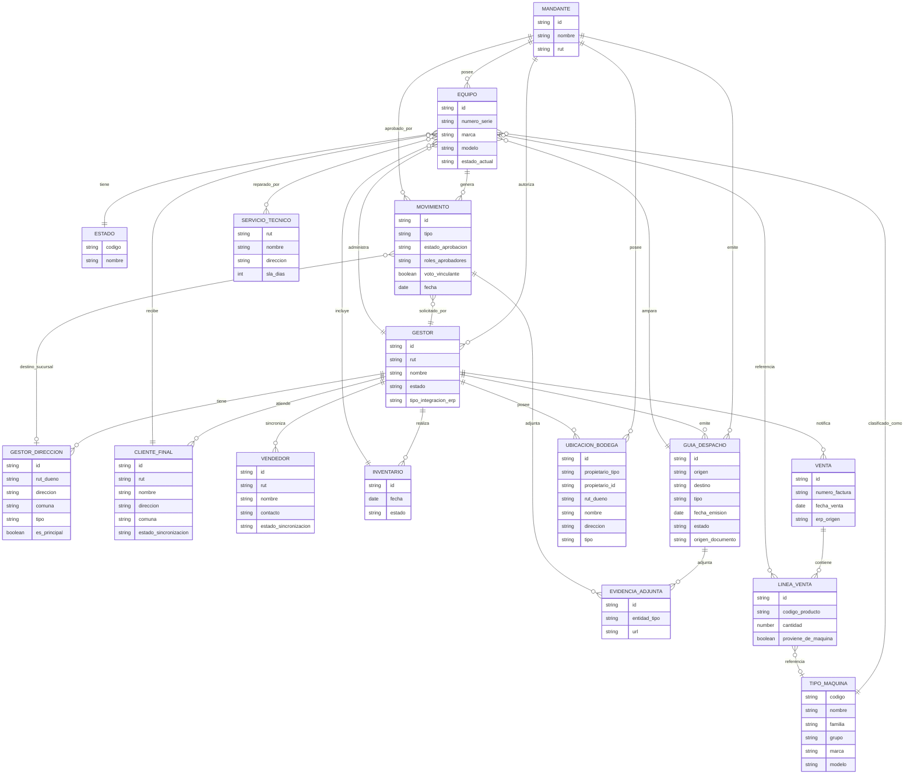

# Diagramas del Sistema

## 1. Diagrama de casos de uso



## 2. Diagrama de flujo — Carga y Recepción de Equipos

> Basado en `Flujo_Carga_de_Maquinas_ERP.pdf` (validado con imagen proporcionada por usuario) y actualizado con respuestas de la reunión de validación del 03/07/2026.




**Caso especial — Rechazo del lote COMPLETO** _(confirmado 03/07/2026, RN-9)_: si el Gestor reporta problema en **todas** las máquinas del lote, el sistema aplica el mismo mecanismo que para un equipo individual rechazado — no existe un flujo separado. El lote completo queda en estado "Rechazado", a la espera de que el Mandante lo retire.


<details>

<summary>Preguntas del diagrama fuente — Estado final: ¿Qué pasa si el Gestor no acepta las máquinas?</summary>

RESPONDIDA: el flujo permite aceptación condicional (inspecciona y acepta lo que está bien, reporta lo que está mal).

</details>

<details>

<summary>Preguntas del diagrama fuente — Estado final: ¿Qué pasa si el Gestor acepta por error todas las máquinas, siendo que hay una mala?</summary>

RESPONDIDA: el flujo requiere inspección visual previo a aceptación, permitiendo notificación de máquinas con problemas.

</details>

<details>

<summary>Preguntas del diagrama fuente — Estado final: ¿Qué pasa si rechaza el lote COMPLETO?</summary>

RESPONDIDA 03/07/2026: mismo mecanismo que rechazo individual (ver arriba, RN-9).

</details>

<details>

<summary>Preguntas del diagrama fuente — Estado final: ¿Qué pasa si el Gestor maneja máquinas propias (no del Mandante)?</summary>

RESPONDIDA 03/07/2026: no aplica en esta fase, no se gestionan máquinas propias del Gestor (RN-10).

</details>

<details>

<summary>Preguntas del diagrama fuente — Estado final: Nuevo</summary>

el flujo ahora incluye la emisión de **Guía de Despacho** vía API de facturación del Mandante, que se puede gestionar **durante o después** de confirmada la asignación (RN-16). Al confirmar el envío, el modal ofrece 3 opciones: Generar vía API, Subir PDF, o Hacer más tarde. Si se pospone, los botones quedan disponibles en Asignaciones y Guías de Despacho.

</details>

## 3. Diagrama de flujo — Ciclo de vida general del activo

> Basado en `PROPOSAL.md`, sección 7.



## 4. Diagrama de componentes / arquitectura



## 5. Diagrama de secuencia — Asignación y Recepción de Equipos



## 6. Diagrama Entidad-Relación (ERD)

> Ver `data_model.md` para el detalle completo de campos, tipos y justificación (fuente de verdad del modelo). Este diagrama es la versión visual resumida, resincronizada 10/07/2026 con la minuta de revisión de maqueta: Gestor como término visible, direcciones múltiples, clientes/vendedores solo lectura ERP, RUT obligatorio en bodegas, aprobación configurable y Guía de Despacho vía API.



## 7. Diagrama de navegación (pantallas del prototipo)

> Actualizado 04/07/2026: los sidebars de ambos roles se reorganizaron en secciones **Principal**, **Operación**, **Análisis**, **Maestros** y **Configuración** (ver `maestros.md`). Las opciones de maestros no llevan el prefijo "Maestro de".
>
> Actualizado 17/07/2026 (proceso de Inventario): se agregó "Consulta de Inventario" (solo lectura, MAN-7) al panel del Mandante. La toma física en terreno se documenta en el proyecto Prototipo Móvil Máquinas; sus resultados deben alimentar la consulta y seguimiento web (GEN-5).
>
> Actualizado 10/07/2026: alineado con la minuta de revisión de maqueta. "Gestor" se usa como nombre técnico heredado en rutas, pero la terminología funcional visible es **Gestor**. Se eliminan del sidebar Mandante los submenús Grupo de Máquinas, Familia de Máquinas, Marcas y Modelos; esas clasificaciones provienen de la carga masiva de equipos. Clientes y Vendedores del Gestor quedan como vistas de solo lectura sincronizadas por ERP.
>
> Actualizado 07/07/2026: se eliminaron los nodos D7 ("Sincronización de Clientes vía API") y D8 ("Notificación de Ventas vía API") — su funcionalidad se documenta como definiciones técnicas de API en `reglas-de-negocio.md` §4, no como pantallas del prototipo. "Guías de Despacho" (D11) y "Reportes" (D6) ya estaban en el sidebar y ahora tienen prompts individuales en `stitch_prompts.md` (3.6 y 3.7 respectivamente). Se agregó M10 ("Guías de Despacho") al panel Mandante (Operación) y D0c ("Vendedores") al panel Gestor (Maestros), alineado al prototipo implementado.

```mermaid
flowchart TD
    Login[Login] --> RolCheck{Rol seleccionado manualmente}
    RolCheck -->|Mandante| DashM[Dashboard Mandante]
    RolCheck -->|Gestor| DashD[Dashboard Gestor]

    subgraph PrincipalM["Principal — Mandante"]
        M0[Dashboard]
        M3[Asignación de Equipos a Gestor]
    end

    subgraph OperacionM["Operación — Mandante"]
        M4[Autorización de Movimientos]
        M9[Consulta de Inventario *solo lectura*]
        M5[Trazabilidad]
        M10[Guías de Despacho]
    end

    subgraph AnalisisM["Análisis — Mandante"]
        M6[Informes: Geolocalización / Ventas / SSTT]
    end

    subgraph MaestrosM["Maestros — Mandante"]
        M1[Equipos]
        M2[Gestores]
        M2b[Servicio Técnico]
        M2e[Ubicaciones / Bodegas]
        M2f[Motivos de Movimiento]
        M2h[Tipos de Solicitud]
        M2g[Plantillas de Inspección]
        M2k[Tipos de Incidencias / Catálogo de Fallas]
    end

    subgraph ConfigM["Configuración — Mandante"]
        M7[Usuarios]
        M8[Roles]
    end

    DashM --> PrincipalM
    DashM --> OperacionM
    DashM --> AnalisisM
    DashM --> MaestrosM
    DashM --> ConfigM

    M3 --> M3b[GD: 3 opciones al confirmar — Generar API / Subir PDF / Hacer más tarde]

    subgraph PrincipalD["Principal — Gestor"]
        D0d[Dashboard]
        D1[Recepción de Equipos]
        D3[Asignación a Clientes — vista de listado]
    end

    subgraph OperacionD["Operación — Gestor"]
        D4[Solicitud de Movimiento]
        D5[Gestión de Inventario — vista de listado]
        D11[Guías de Despacho]
    end

    subgraph AnalisisD["Análisis — Gestor"]
        D6[Reportes de Ventas y Rendimiento]
    end

    subgraph MaestrosD["Maestros — Gestor"]
        D0[Clientes — solo lectura ERP]
        D0c[Vendedores — solo lectura ERP]
        D0b[Ubicaciones / Bodegas]
    end

    subgraph ConfigD["Configuración — Gestor"]
        D9[Usuarios]
        D10[Roles]
    end

    DashD --> PrincipalD
    DashD --> OperacionD
    DashD --> AnalisisD
    DashD --> MaestrosD
    DashD --> ConfigD

    D3 --> D3c[Asignación a Clientes — pantalla de creación]
    D3 --> D3b[Guía de Despacho: gestionada desde tabla de Asignaciones Realizadas — RN-16]
    D3b --> D3b1[Generar GD — automática vía ERP Isstec]
    D3b --> D3b2[Subir PDF — carga manual para ERP externo / Mandante]

    D5 --> D5a[Solicitud de Inventario — pantalla de creación]
    D5 --> D5c[Registro de Conteo Físico — ingreso manual de conteo por equipo]
    D5 --> D5b[Ajuste de Inventario — pantalla de ajuste de discrepancias]
    D5a --> D5c
    D5c --> D5b

    D1 --> D2[Inspección: modal con planilla por equipo — Aceptar / Con Problema / Rechazar (RN-25)]
```
