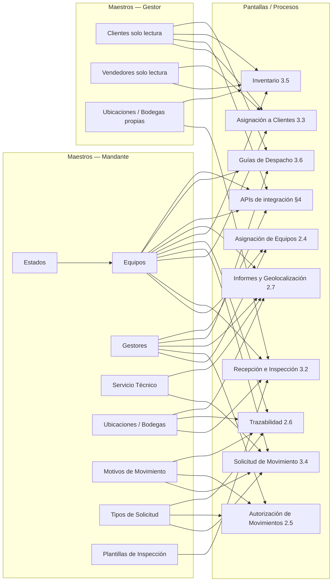

# Maestros del Sistema

> Documento de referencia de los **datos maestros** de la plataforma, creado el 04/07/2026 para alinear la documentación con la reorganización del prototipo (sesión "Refactor Gestores Page", 03/07/2026) y actualizado con la minuta de revisión de maqueta del 10/07/2026. Los sidebars de Mandante y Gestor agrupan la navegación en secciones **Principal**, **Operación**, **Análisis**, **Maestros** y **Configuración**.
>
> Convención de nomenclatura: las opciones de menú **no llevan el prefijo "Maestro de"** — se nombran directo ("Equipos", "Clientes", "Gestores", etc.). Aplica también a maestros futuros.

## 1. Maestros del Mandante (implementados en el prototipo)

| # | Maestro | Propósito | Estado en prototipo | Entidad en `data_model.md` |
| - | ------- | --------- | ------------------- | -------------------------- |
| 1 | **Equipos** | Registro central de todos los activos fríos del Mandante (marca, modelo, N° de serie, estado). Se alimenta por **carga masiva** Excel/API; no existe alta individual de equipos. | ✅ Pantalla funcional (`maestro-equipos.html`) — botón "Nuevo equipo" eliminado, solo carga masiva *(aplicado 12/07/2026)* | `equipo` (§2.4) |
| 2 | **Gestores** | Alta y administración de gestores autorizados (RUT, nombre, múltiples direcciones/sucursales, estado, tipo de integración ERP). | ✅ Pantalla funcional (`gestores.html`) — formulario soporta múltiples direcciones/sucursales con agregar/quitar dinámico *(aplicado 12/07/2026)* | `gestor` / `gestor_direccion` (§2.3) |
| 3 | **Servicio Técnico** | Proveedores de SSTT autorizados para reparar equipos (RUT, nombre, dirección, SLA en días). | ✅ Pantalla funcional (`servicio-tecnico.html`) | `servicio_tecnico` (§2.3) |
| 4 | **Ubicaciones / Bodegas** | Lugares físicos donde puede estar un equipo: bodegas del Mandante, del Gestor, puntos de retiro. Incluye **RUT obligatorio del dueño** de la instalación. | ✅ Pantalla funcional (`ubicaciones-bodegas.html`) — campo RUT obligatorio agregado en tabla y modales *(aplicado 12/07/2026)* | `ubicacion_bodega` (§2.8b) |
| 5 | **Motivos de Movimiento** | Catálogo de razones por las que se mueve un equipo (asignación, baja, cambio, reparación, devolución), con configuración de **roles aprobadores** y **voto vinculante**. | ✅ Pantalla funcional (`motivos-movimiento.html`) — debe agregar roles aprobadores y voto vinculante | `tipo_movimiento` (§2.2) |
| 6 | **Tipos de Solicitud** | Catálogo **estandarizado por el Mandante** de todos los tipos de solicitud que existen en la plataforma. El Gestor solo selecciona de los tipos disponibles. | ✅ Pantalla funcional (`tipos-solicitud.html`) | `tipo_solicitud` (§2.2) — FK a `tipo_movimiento` nullable |
| 7 | **Plantillas de Inspección** | Listas de verificación configurables para la inspección visual en la recepción de equipos por el Gestor, con ítems de checkbox, texto, número o fotografía obligatoria. Cada plantilla se **categoriza por atributos de máquina** (Marca, Modelo, Tipo de Máquina o Familia) con un valor específico — el campo libre "Aplica a" se elimina. Las plantillas no enfocadas a máquinas (Inventario Físico, Post-SSTT) se eliminan. Al asignar equipos, el sistema muestra automáticamente las planillas aplicables según los tipos seleccionados (RN-24). | ✅ Pantalla funcional (`plantillas-inspeccion.html`) — categorización por tipo/marca/modelo/familia aplicada, plantillas no enfocadas a máquinas eliminadas *(aplicado 13/07/2026)* | `plantilla_inspeccion` / `plantilla_inspeccion_item` (pendiente de modelar) |
| 8 | **Tipos de Incidencias / Catálogo de Fallas** | Catálogo de fallas o siniestros que puede sufrir un equipo (código, categoría, severidad, si requiere derivación a SSTT). Corresponde al Módulo de Siniestros e Incidencias (GEN-3). | ✅ Pantalla funcional (`tipos-incidencias.html`) | Pendiente de modelar formalmente (GEN-3) |

Los submenús **Grupo de Máquinas**, **Familia de Máquinas**, **Marcas** y **Modelos** quedan eliminados de la navegación del Mandante *(aplicado 12/07/2026)*. Sus datos siguen existiendo como atributos de clasificación importados en la carga masiva de equipos y usados por filtros, reportes y matching venta↔máquina, pero no se administran manualmente como maestros en esta fase.

Además, la sección **Configuración** del Mandante incluye **Usuarios** y **Roles** — no son maestros de negocio sino configuración del sistema (ver AUTH-2 en [requerimientos-de-producto.md](requerimientos-de-producto.md "mention")). Ambas pantallas están **completamente implementadas** en el prototipo (maestro de usuarios, maestro de roles): tabla con filtros, modales de alta/edición y, en el caso de Roles, un acordeón funcional de permisos por sección del sidebar.

## 2. Maestros del Gestor (implementados en el prototipo)

| # | Maestro                   | Propósito                                                                                                                                                                                | Estado en prototipo                                                                                                                                         | Entidad en `data_model.md` |
| - | ------------------------- | ---------------------------------------------------------------------------------------------------------------------------------------------------------------------------------------- | ----------------------------------------------------------------------------------------------------------------------------------------------------------- | -------------------------- |
| 1 | **Clientes**              | Puntos de venta (clientes finales) del Gestor, sincronizados automáticamente desde su ERP vía API (RN-11/RN-12/RN-19). Es una vista de solo lectura: no permite crear ni editar clientes. | ✅ Pantalla de solo lectura (`clientes.html`) — botones de agregar/editar eliminados, modales removidos *(aplicado 12/07/2026)* | `cliente_final` (§2.3) |
| 2 | **Vendedores**            | Vendedores del Gestor, sincronizados automáticamente desde su ERP vía API. Es una vista de solo lectura: no permite crear/editar vendedores ni asignar clientes manualmente.             | ✅ Pantalla de solo lectura (`vendedores.html`) — botones de agregar/editar/asignar eliminados, modales removidos *(aplicado 12/07/2026)* | `vendedor` (§2.3) |
| 3 | **Ubicaciones / Bodegas** | Bodegas y puntos de retiro propios del Gestor donde recibe, almacena o retira equipos. Incluye RUT obligatorio del dueño de la instalación.                                               | ✅ Pantalla funcional (`distribuidor/ubicaciones-bodegas.html`) — campo RUT obligatorio agregado en tabla y modales *(aplicado 12/07/2026)* | `ubicacion_bodega` (§2.8b) |

La sección **Configuración** del Gestor también incluye **Usuarios** y **Roles** — ambas pantallas están **completamente implementadas** en el prototipo (maestro de usuarios, maestro de roles), con el mismo patrón que sus equivalentes del Mandante: tabla con filtros, modales de alta/edición y acordeón de permisos por sección.

> **Nota (10/07/2026, aplicado 12/07/2026):** **Clientes** y **Vendedores** permanecen visibles en el panel del Gestor como vistas de solo lectura. Los enlaces del sidebar fueron removidos; las pantallas conservan tabla y filtros pero sin botones de acción ni modales. La información pertenece al ERP y se sincroniza automáticamente; no se administra manualmente en esta plataforma.

## 3. Conexiones de los maestros con pantallas y procesos

Cada maestro alimenta una o más pantallas operativas. Un cambio en un maestro impacta directamente los procesos listados.

### 3.1 Matriz maestro → pantalla / proceso

| Maestro | Pantallas / procesos que lo consumen | Cómo lo usan |
| ------- | ------------------------------------ | ------------ |
| **Equipos** | Asignación de Equipos · Recepción de Equipos · Asignación a Clientes · Solicitud de Movimiento · Autorización de Movimientos · Trazabilidad · Inventario · Informes/Geolocalización · Guías de Despacho · Reportes · APIs de integración | Es el núcleo: toda operación referencia un `equipo` por N° de serie. Su estado cambia con cada proceso (Activo → Asignado al Gestor → Asignado a Cliente → En SSTT → Baja, etc.). Marca, modelo, grupo y familia se importan con la carga masiva y se usan para filtros/reportes, no como submenús. |
| **Gestores** | Asignación de Equipos · Maestro de Equipos · Autorización de Movimientos · Informes · Guías de Despacho · APIs de integración | Identifica a quien recibe y administra los equipos. Incluye tipo de integración ERP y múltiples direcciones/sucursales. Solo gestores activos pueden recibir asignaciones. La asignación de equipos requiere seleccionar obligatoriamente una sucursal de destino desde las direcciones del gestor (RN-23). |
| **Servicio Técnico** | Solicitud de Movimiento · Autorización de Movimientos · Informe de Servicio Técnico | El SLA del proveedor permite medir atrasos en reparación (MAN-3, MAN-12). |
| **Clientes** (Gestor, solo lectura) | Asignación a Clientes · Guía de Despacho Gestor→Cliente · APIs de integración · Reporte Cliente–Máquina · Inventario · Geolocalización | Sin cliente sincronizado no se puede asignar equipo a punto de venta. Fuente exclusiva: API del ERP del Gestor. |
| **Vendedores** (Gestor, solo lectura) | Inventario · Asignación de Clientes · Reportes | El vendedor es filtro operativo para inventarios y análisis. Fuente exclusiva: API del ERP del Gestor. |
| **Ubicaciones / Bodegas** | Recepción de Equipos · Trazabilidad · Geolocalización · Inventario · Retiro de rechazados | Da un origen/destino físico normalizado. Debe incluir RUT obligatorio del dueño de la instalación (Mandante o Gestor). |
| **Motivos de Movimiento** | Solicitud de Movimiento · Autorización de Movimientos · Trazabilidad · Reporte de problemas en Recepción | Normaliza razones de movimiento y define roles aprobadores/voto vinculante para automatizar el flujo de aprobación. |
| **Tipos de Solicitud** | Solicitud de Movimiento · Autorización de Movimientos · Trazabilidad · Gestión de Inventario | El Mandante estandariza todos los tipos de solicitud para que todos los gestores usen las mismas categorías. |
| **Plantillas de Inspección** | Asignación de Equipos · Recepción de Equipos · Detalle de Asignación (Mandante) | Estandariza qué se revisa al aceptar/rechazar; puede exigir checkbox, texto, número o fotografía según ítem. Las planillas se muestran automáticamente en el panel resumen de asignación según los tipos de máquina seleccionados (RN-24). El gestor inspecciona por equipo usando un modal con la planilla aplicable (RN-25). El Mandante ve los resultados en el detalle de la asignación. |
| **Tipos de Incidencias** | Recepción de Equipos · Solicitud de Movimiento | Cataloga las fallas que justifican derivar un equipo a SSTT, dejarlo pendiente de revisión o darlo de baja. |
| **Estados** | Todas las pantallas con badge de estado · Workflow completo del ciclo de vida | Catálogo transversal: Activo, Asignado al Gestor, Asignado a Cliente, En SSTT, Pendiente de Revisión, Rechazado, Baja. Es distinto del estado del lote y del estado de aprobación. |
| **Usuarios / Roles** | Login · Todos los paneles · Auditoría | Define quién opera como Mandante o Gestor y con qué permisos. Los roles también pueden ser usados como aprobadores en motivos de movimiento. |

### 3.2 Diagrama de dependencias

> **Nota de actualización (10/07/2026):** Grupo/Familia/Marca/Modelo ya no aparecen como nodos de maestros porque no son pantallas administrables. Permanecen como atributos importados dentro de **Equipos** y se consumen desde reportes, búsqueda y APIs de matching.

### 3.3 Proceso de Inventario (Mandante y Gestor)

> No es un maestro, pero se documenta aquí porque conecta directamente con varios maestros (Equipos, Ubicaciones/Bodegas) y con la definición original de la propuesta (`PROPOSAL.md` §3.2–3.4).

[.](./ "mention") define el inventario en **dos capas** que no deben confundirse:

| Capa                                     | Descripción                                                                                                                                                                                     | Responsable                                                                                                                                      | Alcance actual                                                                                           |
| ---------------------------------------- | ----------------------------------------------------------------------------------------------------------------------------------------------------------------------------------------------- | ------------------------------------------------------------------------------------------------------------------------------------------------ | -------------------------------------------------------------------------------------------------------- |
| **1. Gestión web del inventario**        | Solicitar toma de inventario (por vendedor/comuna/fecha), registrar el conteo físico por equipo, consultar su estado (en curso/finalizado) y ajustar el sistema según discrepancias encontradas | Gestor (DIS-5 a DIS-7, vistas `inventario.html` ✅ + `solicitud-inventario.html` ✅ + `registro-conteo.html` ✅ + `ajuste-inventario.html` ✅) | **Dentro de alcance** de esta fase                                                                       |
| **2. Auditoría física georreferenciada** | Lectura de código/QR en terreno, confirmación de presencia física del equipo, captura de coordenadas GPS y evidencia fotográfica (incluye detectar uso indebido del equipo)                     | Personal de terreno vía **app móvil** (`PROPOSAL.md` §3.4)                                                                                       | **Fuera de alcance** — pospuesta explícitamente (GEN-5), sin pantallas ni prompts de Stitch en esta fase |

**Mandante:** consume la Capa 1 en modo **solo lectura** (MAN-7 "Control de Inventario") — visualiza los inventarios en curso/finalizados y las discrepancias que cada Gestor reporta, pero no genera solicitudes ni realiza ajustes; esa operación es exclusiva del Gestor. Implementada en la vista de consulta de inventario, accesible desde la sección **Operación** del sidebar.

**Gestor:** ya tiene la Capa 1 completa e implementada en cuatro vistas separadas que cubren el flujo completo del inventario:



## Vista de listado

`inventario.html`, §3.5a — el sidebar "Inventario" dirige aquí; muestra todas las solicitudes con su estado y botones de acción según el estado.



## Solicitud

`solicitud-inventario.html`, §3.5b — el botón "Nueva solicitud" enlaza aquí; crea la solicitud con filtros (vendedor/comuna/fechas), estado inicial "En curso".



## Registro de conteo físico

`registro-conteo.html`, §3.5d — el botón "Registrar conteo" en filas "En curso" enlaza aquí; el Gestor ingresa manualmente el conteo físico por equipo. Al finalizar, el inventario pasa a "Finalizado" (sin discrepancias) o "En ajuste" (con discrepancias). Este paso resuelve el hueco donde los valores físicos no tenían un punto de ingreso definido.



## Ajuste

`ajuste-inventario.html`, §3.5c — el botón "Ajustar" en filas "En ajuste" enlaza aquí; corrige el valor del sistema según el conteo físico registrado en el paso anterior. Al confirmar, el inventario pasa a "Finalizado".



El flujo completo es: **3.5b (solicitud) → 3.5d (registro de conteo) → 3.5c (ajuste)**. Esto replica el patrón de navegación de Recepción de Equipos (3.2a→3.2b) y Asignación a Clientes (3.3a→3.3b), donde el sidebar dirige al listado y los botones de acción enlazan a las sub-vistas.

**State machine del inventario (07/07/2026):**

| Estado         | Color badge             | Descripción                                                                                           | Transiciones                                                       |
| -------------- | ----------------------- | ----------------------------------------------------------------------------------------------------- | ------------------------------------------------------------------ |
| **En curso**   | Azul (`badge-transito`) | Solicitud creada, conteo físico pendiente                                                             | → Finalizado (sin discrepancias) · → En ajuste (con discrepancias) |
| **En ajuste**  | Naranja (`badge-sstt`)  | Conteo completo con discrepancias, pendiente de ajuste                                                | → Finalizado (al confirmar ajustes)                                |
| **Finalizado** | Verde (`badge-activo`)  | Inventario completado: sin discrepancias desde el inicio, o tras ajustar las discrepancias detectadas | Estado terminal                                                    |

La Capa 2 de la aplicación móvil complementaria alimentará los resultados mostrados en la Capa 1 (el resultado de una auditoría física se reflejará como un inventario "finalizado" con sus discrepancias) — no reemplaza el flujo web, lo complementa.

## 4. Decisiones tomadas (03/07/2026)

* **Sin prefijo "Maestro de"** en la navegación — las opciones se nombran directo.
* **"Proveedores de Servicio Técnico" = "Servicio Técnico"**: eran lo mismo; se descartó la sugerencia redundante.
* **Contratos de Comodato NO es un maestro separado** (por ahora): los campos de contrato viven como atributos del `movimiento` de asignación (ver `data_model.md` §2.5). Un maestro separado solo se justificaría si el negocio necesita renovaciones masivas o alertas de vencimiento — fuera del alcance actual.
* **Usuarios y Roles van en sección "Configuración"** aparte, en ambos paneles — no se mezclan con maestros de negocio.
* **Tipos de Solicitud es un maestro separado de Motivos de Movimiento** (04/07/2026): los motivos catalogan _por qué_ se mueve un equipo (todos los movimientos, incluidos los automáticos); los tipos de solicitud catalogan _qué tipos de solicitud existen en la plataforma_ y cuáles requieren aprobación. Cada tipo de solicitud puede referenciar un motivo de movimiento (ej. "Baja definitiva" → BAJA, "Cambio de equipo" → CAMBIO, "Envío a SSTT" → ENVIO\_SSTT, "Retorno al Mandante" → RETORNO\_MANDANTE), o no tener motivo asociado cuando no genera un movimiento (ej. "Solicitud de Inventario").
* **El Mandante estandariza todos los tipos de solicitud** (05/07/2026): aunque algunas solicitudes son internas del Gestor (como inventario), el Mandante debe gestionar y estandarizar los tipos para que todos los gestores usen las mismas categorías. Si se dejara al Gestor, cada uno crearía sus propios tipos inconsistentemente. El campo `requiere_aprobacion` distingue cuáles necesitan validación del Mandante (baja, cambio, SSTT, retorno) de las que no (inventario).

## 5. Posibles maestros futuros (no implementados)

Candidatos evaluados según el contexto del proyecto. No están en el prototipo ni comprometidos para esta fase.

### 5.1 Mandante

| Maestro candidato                   | Propósito                                                                              | Justificación / condición para agregarlo                                                                                                               |
| ----------------------------------- | -------------------------------------------------------------------------------------- | ------------------------------------------------------------------------------------------------------------------------------------------------------ |
| **Clientes Finales (solo lectura)** | Vista consolidada de los clientes que cada Gestor tiene asignados a equipos.     | El Mandante no los gestiona, pero gana visibilidad de dónde terminan sus máquinas. Útil si los informes actuales (2.7, DIS-11) resultan insuficientes. |
| **Tipos de Garantía**               | Catálogo de garantías (de fábrica, extendida, sin garantía) y sus duraciones.          | El ERP Isstec ya tenía `tipo_garantia_codigo` en `maquina_movimiento`; agregarlo cuando la gestión de garantías pase a ser requisito.                  |
| **Contratos de Comodato**           | Gestión de contratos por asignación (vigencias, renovaciones, alertas de vencimiento). | Descartado por ahora (ver §4); reevaluar si negocio pide renovaciones masivas o alertas.                                                               |
| **Tipos de Siniestro**              | Catálogo de incidencias (robo, pérdida, destrucción) para el módulo GEN-3.             | Requerido si se implementa el Módulo de Siniestros e Incidencias (Should).                                                                             |

### 5.2 Gestor

| Maestro candidato                    | Propósito                                                                                         | Justificación / condición para agregarlo                                                                                         |
| ------------------------------------ | ------------------------------------------------------------------------------------------------- | -------------------------------------------------------------------------------------------------------------------------------- |
| **Rutas de Distribución**            | Configuración de rutas para entrega/retiro de equipos a clientes.                                 | Solo si se aborda logística de transporte — hoy la plataforma traza el movimiento, no la ruta.                                   |
| **Transportistas / Choferes**        | Personal o terceros que realizan los traslados físicos.                                           | Complementa Guías de Despacho con responsable del traslado; el ERP Isstec ya maneja choferes (referencia: `Ultimate.Padsystem`). |
| **Motivos de Devolución**            | Razones por las que un cliente devuelve un equipo (falla, término de contrato, cambio de modelo). | Puede resolverse como subconjunto de **Motivos de Movimiento** — evaluar antes de crear un maestro aparte.                       |
| **Plantillas de Inspección propias** | Checklists de inspección definidos por el Gestor.                                           | Solo si el negocio decide que la inspección no la estandariza únicamente el Mandante.                                            |
